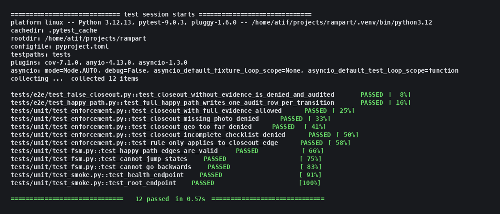
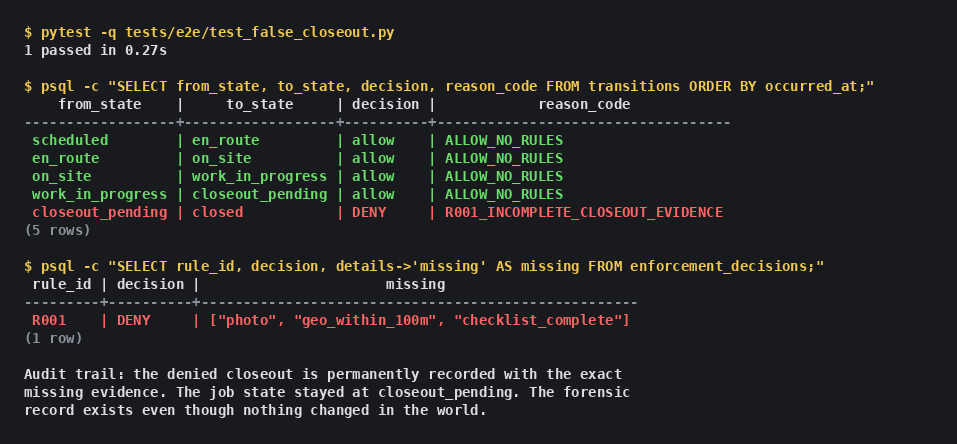
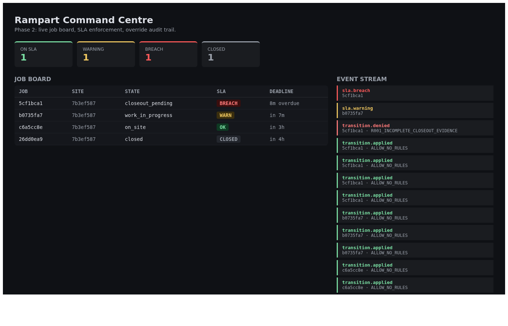
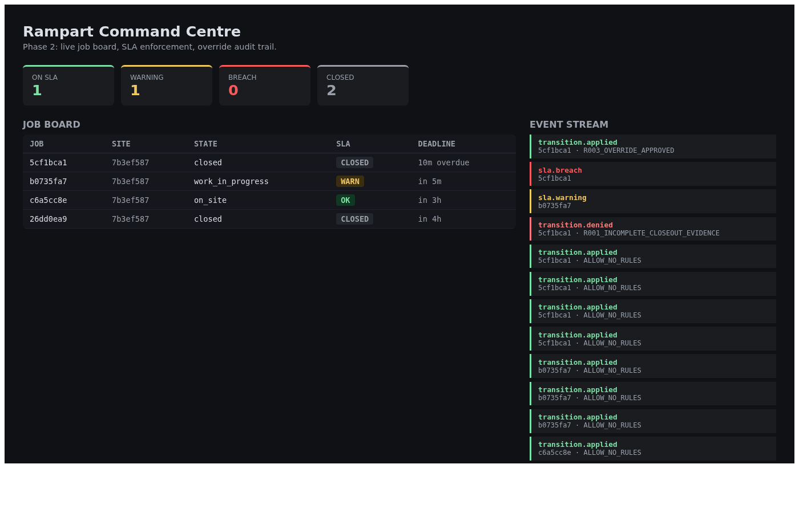
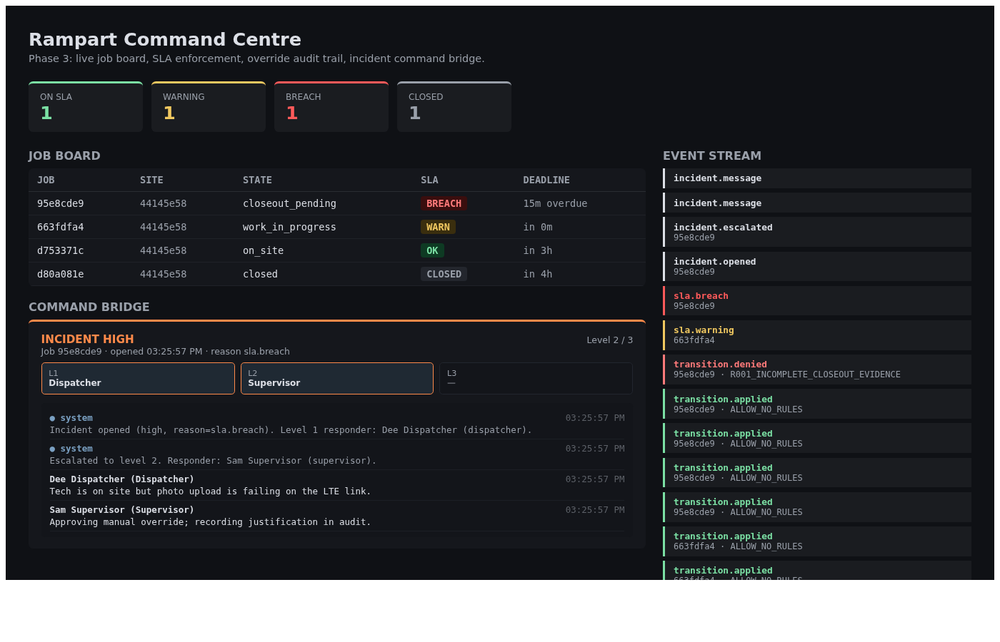
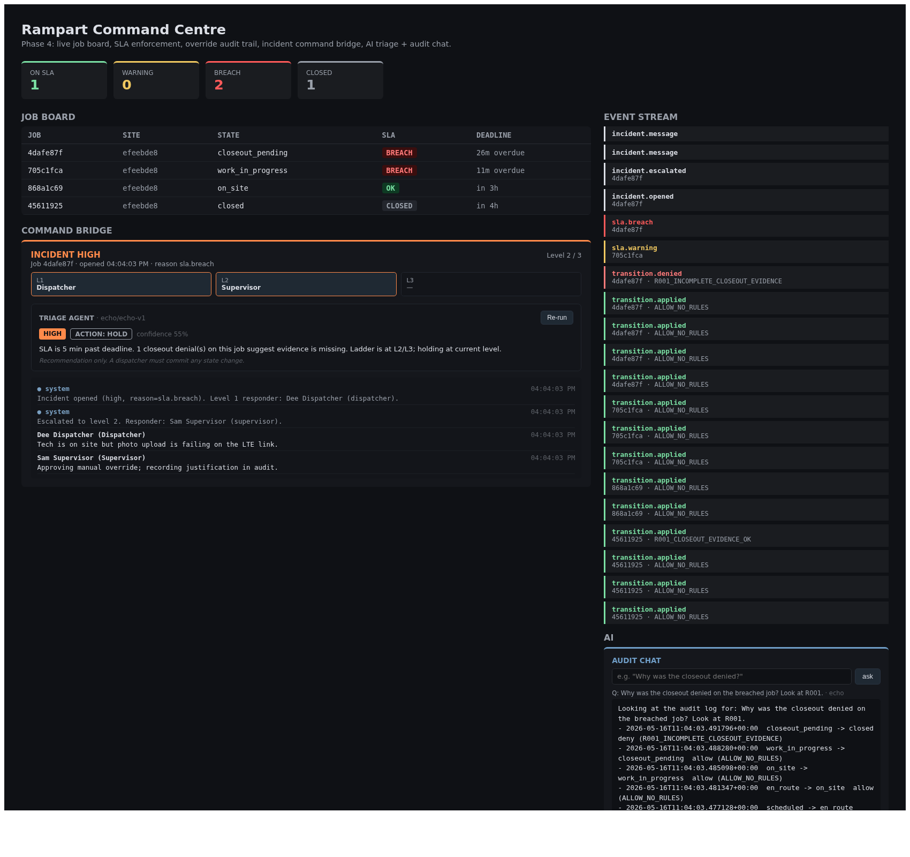

# Rampart

Enforcement-first operational OS for field service ops. Deterministic workflow engine, AI-augmented incident command.

Rampart runs the operational side of any field service business: dispatching jobs to technicians, enforcing SLA windows, opening an incident command bridge when sites escalate, and keeping an immutable audit trail of every state change and every override. The deterministic core never lets a job be falsely closed. The AI layer triages incidents, ranks dispatch options, drafts closeout reports, and answers natural-language questions over the audit log.

## What it does

Rampart sits between dispatchers, field technicians, supervisors, and the command centre. Every job runs through a strict workflow with guards and side effects on each transition. Every transition is auditable. Every override is captured with actor, role, justification, and approval. When a job risks breaching its SLA, the system raises a warning before the breach, then an enforcement event at breach, then escalates up the on-call ladder if nobody acknowledges it. The command-centre dashboard shows the whole field as a live operational twin.

## Features

### Deterministic core (the part that cannot lie)

- **Workflow state machine**: declarative FSM per job type, atomic transitions, guards run pre-transition, side effects run post-transition.
- **Centralized enforcement engine**: one decision point for "can this actor make this transition right now?" Returns `allow`, `deny`, `allow_with_override`, or `escalate`, with structured reason codes.
- **Override + escalation**: every override is captured with justification, supervisor approval, and expiry. Escalation ladder per severity, from dispatcher to command centre.
- **Audit persistence**: every state change writes a row in the same transaction. Immutable change log. Integrity-checkable.
- **Real-time event bus**: Redis Streams broadcasts every operational event so any subscriber (dashboard, SLA watcher, AI layer) can react.

### Operations layer

- **Dispatch intelligence**: technician ranking by skill match, distance, current load, historical SLA performance.
- **Incident command**: opens an incident room bundling the job, all events, active responders, timeline, on-call rotation, and chat.
- **SLA watcher**: background worker checks open jobs against deadlines, emits warnings before breach and enforcement events at breach.
- **Predictive risk scoring**: per-job risk score from tech performance, site difficulty, weather, parts availability.
- **Digital operational twin**: live aggregated view of every site and every tech, materialized from the event stream.

### AI layer (Gemini-powered, recommendation only)

The deterministic core never calls an LLM. The AI services read the event stream and write back recommendations that humans approve.

- **Triage agent**: classifies incident severity + recommended escalation level from the event timeline.
- **Dispatch agent**: ranks available techs for a new job, dispatcher commits.
- **Closeout drafter**: drafts the customer-facing report from work log + photos; tech edits and signs.
- **Audit chat**: natural-language Q&A over the audit log and event store, returns a timeline view.

## Phases

- **Phase 0 (scaffold)**: repo, structure, README, HANDS-ON, docker-compose for postgres+redis, FastAPI hello-world, React shell. Done.
- **Phase 1**: FSM engine + audit log + enforcement engine on the happy path (one job type, scheduled to closed), with the false-closeout rejection proven by tests. Done.
- **Phase 2**: Redis Streams event bus, SLA watcher (warning + breach), override capture with R003 (manager role + justification + expiry), and a live React command-centre dashboard polling the API. Done.
- **Phase 3**: incident room model (job, severity, responders, chat, system timeline), severity-based escalation ladder, on-call rotation lookup, command-bridge panel in the dashboard, SLA-breach auto-opens an incident. Done.
- **Phase 4**: AI layer with a provider abstraction (Groq for real LLM, deterministic Echo for offline), four agents (triage, dispatch, closeout drafter, audit chat), every output saved as a recommendation that humans commit. Triage card + audit chat panel in the dashboard. Done.
- **Phase 5**: predictive risk + digital twin + adversarial test suite + walkthrough video + portfolio site case study.

## Screenshots

### Phase 1: deterministic core, all tests green

Twelve tests cover the FSM edge map, the R001 closeout-evidence rule (happy and four denial paths), and two end-to-end paths against a real Postgres: the full happy path from scheduled to closed, and a false closeout that R001 must reject.

### Phase 1: the false closeout, forensically recorded

When R001 denies a closeout, the denied transition still lands in the audit log alongside a per-rule row that lists exactly which evidence was missing. The job state stays at `closeout_pending`. The audit story is: nothing happened, and the system can prove who tried, when, and why it was blocked.

### Phase 2: command-centre dashboard, live

Four seeded jobs, four different SLA states. The left column reads from `GET /board` and colour-codes each row by deadline distance. The right column tails the Redis Streams event bus via `GET /events`, showing the `transition.applied` chain plus the `sla.warning`, `sla.breach`, and `transition.denied` entries the seed run produced. The dashboard polls every three seconds; in a real deployment it would subscribe to the stream directly.

### Phase 2: manager override unblocks a denied closeout

The job that was stuck at `closeout_pending` / BREACH in the previous shot is now `closed`. The event stream top entry shows `transition.applied · R003_OVERRIDE_APPROVED`, right above the original `transition.denied · R001_INCOMPLETE_CLOSEOUT_EVIDENCE`. The original denial row is still in the audit log; the override row in `overrides` links the denial to the new allow_with_override transition, with the manager's actor id, role, justification, and expiry recorded. The override never relaxes the rule, it only authorises this single bypass.

### Phase 3: incident room with the command bridge

The SLA-breached job is no longer a passive row on the board. The watcher emitted `sla.breach`, the bridge auto-opened a `HIGH` incident in the same transaction, the on-call dispatcher was seated as the level-1 responder, and a system message landed in the chat. A second action escalated the incident to level 2, pulling the on-call supervisor in. The two chat lines under the ladder are the dispatcher noting the LTE problem and the supervisor approving the manual override. Every step is in `incident_messages`, every responder is in `incident_responders`, every state change is in `transitions`. The event stream on the right shows the full chain from `transition.denied` and `sla.breach` through `incident.opened`, `incident.escalated`, and the two `incident.message` entries.

### Phase 4: AI layer (triage + audit chat)

A `TRIAGE AGENT` card sits inside the command bridge: severity tier, recommended action, confidence, one-line rationale, and the standing reminder that this is a recommendation only. The bottom-right `AUDIT CHAT` panel takes a natural-language question, hands a candidate slice of the audit log + recent incidents + recent events to the configured provider, and writes the answer plus structured citations back. Every agent output lands in `ai_recommendations` (agent, target_kind, target_id, input, output, provider, model, status) so the dashboard can replay history without re-asking the LLM. The provider abstraction means the same agent code runs on a deterministic Echo provider with no key, and flips to Groq the moment `GROQ_API_KEY` lands in `.env`. The deterministic core never imports the AI module: an LLM can suggest, never decide.
